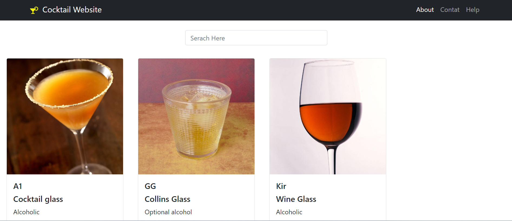

# 🍸 Cocktails Finder

Welcome to **Cocktails Finder**, a sleek and intuitive web application designed to help you explore and discover cocktails. Whether you're a mixology enthusiast or just looking to try something new, our app makes it easy to find detailed information about your favorite drinks.

## 🌐 Live Demo

Check out the live version of the app: [Cocktails Finder](https://gaurav1924.github.io/Cocktail-website-react-redux/)

## 🎨 Features

- **Homepage:** Browse through a wide selection of cocktails. Each cocktail is displayed with an image and a brief description.
- **Cocktail Details:** Click on any cocktail on the homepage to open a detailed view, including ingredients, instructions, and more.
- **Navigation:** Seamlessly navigate between pages with implemented routing. Easily go back and forth between the homepage, cocktail details, and other sections.
- **Header Navigation:** Access the **About**, **Help**, and **Contact** sections through the header for more information about the app, assistance, or to get in touch.

## 🛠️ Technologies Used

- **React**: For building the dynamic user interface and handling the application's state.
- **React Router**: For implementing client-side routing, allowing for smooth navigation between different pages.
- **CSS3**: For styling the application and ensuring a responsive, visually appealing layout.
- **GitHub Pages**: For deploying and hosting the live version of the application.

## 📂 Screenshot

  

## 🚀 Getting Started

### Prerequisites

- Node.js (v14 or above)
- npm or yarn

### Installation

1. **Clone the repository:**
   ```bash
   git clone https://github.com/gaurav1924/Cocktail-website-react-redux.git
   cd Cocktail-website-react-redux
   ```

2. **Install dependencies:**
   ```bash
   npm install
   # or
   yarn install
   ```

3. **Run the development server:**
   ```bash
   npm start
   # or
   yarn start
   ```

4. **Open your browser:**
   Go to `http://localhost:3000` to see the app in action.

### Deployment

The app is deployed using GitHub Pages. To deploy your own version, follow these steps:

1. **Build the project:**
   ```bash
   npm run build
   ```

2. **Deploy to GitHub Pages:**
   ```bash
   npm run deploy
   ```

## 👨‍💻 Contributing

Contributions are welcome! If you have suggestions, bug reports, or improvements, please create an issue or submit a pull request.

1. **Fork the repository**
2. **Create a new branch** (`git checkout -b feature-branch`)
3. **Commit your changes** (`git commit -m 'Add some feature'`)
4. **Push to the branch** (`git push origin feature-branch`)
5. **Create a pull request**

## 📝 License

This project is open-source and available under the [MIT License](LICENSE).
